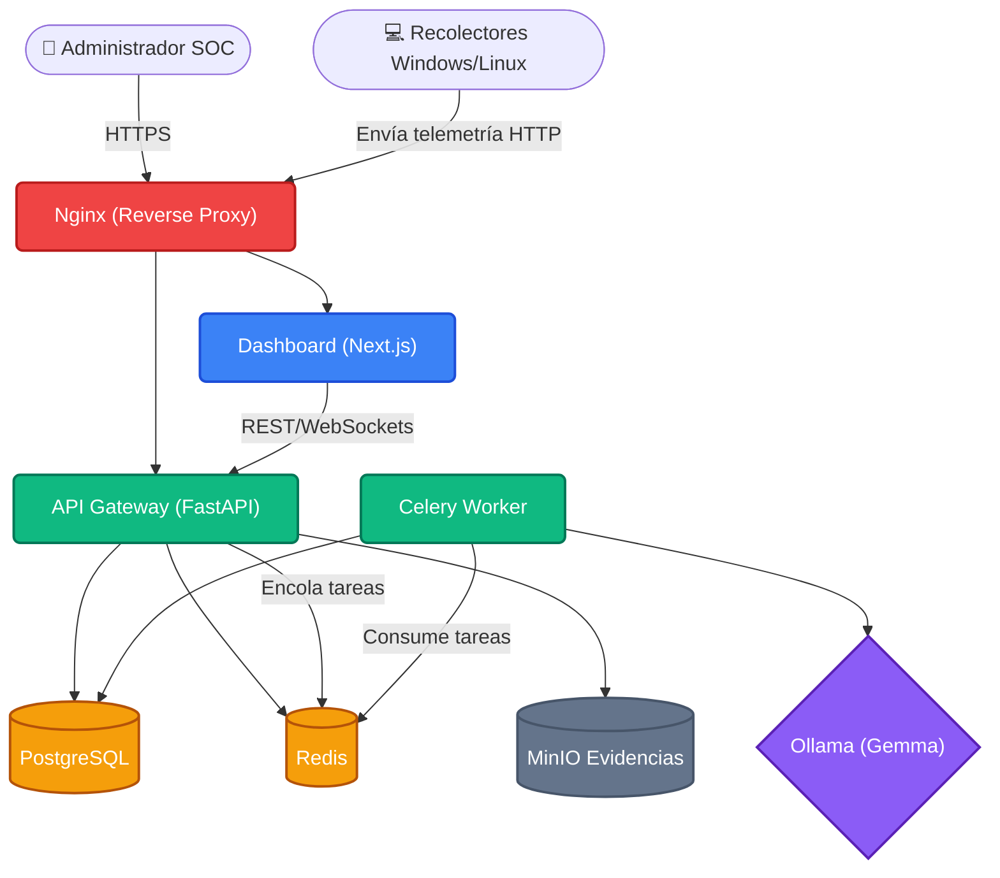
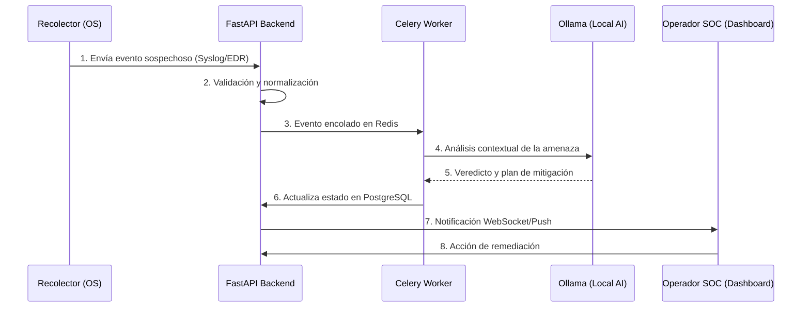

<div align="center">

# 🛡️ CyberGuard AI Platform
**Sistema de Gestión de Seguridad Asistida por Inteligencia Artificial**

[](https://nextjs.org/)
[](https://fastapi.tiangolo.com/)
[](https://postgresql.org/)
[](https://redis.io/)
[](https://ollama.ai/)
[](https://docker.com/)

Una plataforma empresarial de ciberseguridad impulsada por IA, diseñada para monitorear, detectar y responder de manera autónoma a amenazas utilizando modelos de lenguaje locales (Gemma) para análisis de eventos en tiempo real.

[Características](#-características-principales) • [Arquitectura](#-arquitectura-del-sistema) • [Requisitos](#-requisitos-previos) • [Despliegue](#-despliegue-con-docker)

</div>

---

## 🚀 Características Principales

- **🤖 Análisis Asistido por IA (Gemma)**: Procesamiento local de logs y alertas utilizando LLMs a través de Ollama, garantizando 100% de privacidad de datos.
- **📊 Dashboard en Tiempo Real**: Interfaz moderna construida con Next.js + Tailwind CSS.
- **⚡ Backend de Alto Rendimiento**: API RESTful asíncrona implementada con FastAPI y conectada a PostgreSQL y Redis.
- **🕵️ Agentes Recolectores**: Monitoreo de endpoints Multiplataforma (Linux/Windows).
- **🔒 Almacenamiento Inmutable**: Retención segura de evidencias a través de MinIO (compatible con Amazon S3).

---

## 🏗 Arquitectura del Sistema

La plataforma está diseñada mediante una **arquitectura de microservicios** orquestada con Docker Compose, garantizando escalabilidad y aislamiento.



### 🗺️ Mapa de Componentes y Flujo de Datos



---

## ⚙️ Requisitos Previos

- **Docker** v24+
- **Docker Compose** v2+
- **RAM**: Mínimo 8GB (Se recomiendan 16GB+ para un uso fluido de Ollama local).
- **GPU** *(Opcional)*: NVIDIA con CUDA para aceleración del LLM.

---

## 🛠️ Estructura del Proyecto

```bash
📂 Gestion de seguridad asistida por ia/
├── 📂 apps/             # Aplicaciones principales
│   ├── 📂 api/          # Backend FastAPI
│   └── 📂 dashboard/    # Frontend Next.js / React
├── 📂 collectors/       # Agentes recolectores de endpoints
│   ├── 📂 linux/        # Agente para entornos Linux
│   └── 📂 windows/      # Agente para entornos Windows
├── 📂 infra/            # Infraestructura as a Code & Configs
│   ├── 📂 docker/       # Dockerfiles y scripts DB (init.sql)
│   └── 📂 nginx/        # Configuración del proxy inverso
├── 📂 packages/         # Código compartido (librerías internas)
├── 📂 services/         # Servicios adicionales
│   └── 📂 llm/          # Modelos y configuración de Ollama
├── 📄 docker-compose.yml # Orquestación del despliegue local
└── 📄 .env.example      # Plantilla de variables de entorno
```

---

## 🚀 Despliegue con Docker

### 1. Clonar el repositorio
```bash
git clone https://github.com/murdok1982/GestionCIberArtificialIntelligent.git
cd GestionCIberArtificialIntelligent
```

### 2. Configurar entorno
Duplica el archivo de ejemplo para las variables.
```bash
cp .env.example .env
```
Ajusta contraseñas e ID de conexión si lo deseas, aunque funcionará *out of the box* con las predeterminadas.

### 3. Iniciar Servicios
Levanta toda la arquitectura en en modo *detached* para correr en fondo.
```bash
docker compose up -d --build
```

### 4. Verifica y descarga modelo a usar (Gemma u otro)
```bash
docker compose exec ollama ollama run gemma:2b
```

### Acceso a interfaces:
- **💻 Dashboard SOC**: `http://localhost:3000`
- **⚙️ Backend API Docs**: `http://localhost:8000/docs`
- **💾 MinIO Console**: `http://localhost:9001`

---

## 🤝 Contribuciones

Las contribuciones son bienvenidas. Para implementar cambios mayores por favor, abra primero un *Issue* para discutir la integración con el equipo.

> 📝 **Nota:** Este sistema está bajo constante actualización. Asegúrese siempre de correr los contenedores con las últimas versiones aseguradas.

<div align="center">
  <p>Construido con ❤️ para un entorno digital más seguro.</p>
</div>
