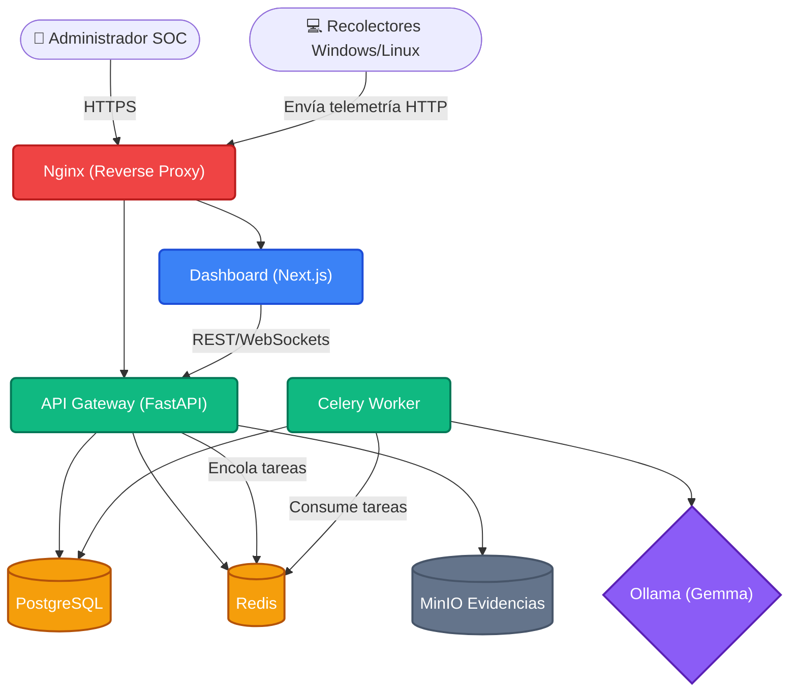
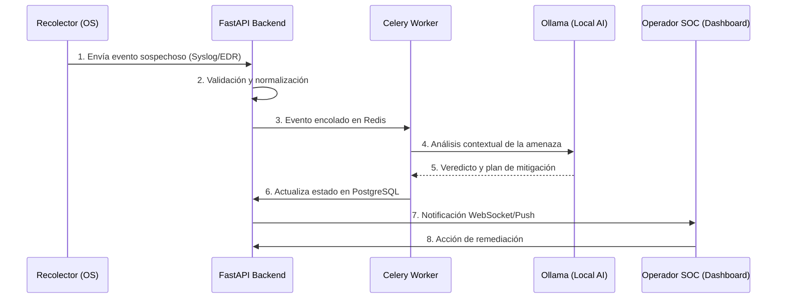

<div align="center">

# 🛡️ CyberGuard AI Platform (HispanShield)
**Sistema de Gestión de Seguridad Asistida por Inteligencia Artificial**

[](https://nextjs.org/)
[](https://fastapi.tiangolo.com/)
[](https://postgresql.org/)
[](https://redis.io/)
[](https://ollama.ai/)
[](https://docker.com/)

Una plataforma empresarial de ciberseguridad impulsada por IA, diseñada para monitorear, detectar y responder de manera autónoma a amenazas utilizando modelos de lenguaje locales (Gemma) para análisis de eventos en tiempo real.

[Características](#-características-principales) • [Arquitectura](#-arquitectura-del-sistema) • [Requisitos](#-requisitos-previos) • [Despliegue](#-despliegue-con-docker)

</div>

---

## 🚀 Características Principales

- **🤖 Análisis Asistido por IA (Gemma)**: Procesamiento local de logs y alertas utilizando LLMs a través de Ollama, garantizando 100% de privacidad de datos.
- **📊 Dashboard en Tiempo Real**: Interfaz moderna construida con Next.js + Tailwind CSS.
- **⚡ Backend de Alto Rendimiento**: API RESTful asíncrona implementada con FastAPI y conectada a PostgreSQL y Redis.
- **🕵️ Agentes Recolectores**: Monitoreo de endpoints Multiplataforma (Linux/Windows).
- **🔒 Almacenamiento Inmutable**: Retención segura de evidencias a través de MinIO (compatible con Amazon S3).

---

## 🏗 Arquitectura del Sistema

La plataforma está diseñada mediante una **arquitectura de microservicios** orquestada con Docker Compose, garantizando escalabilidad y aislamiento.


```mermaid
graph TD
    classDef frontend fill:#3b82f6,stroke:#1d4ed8,stroke-width:2px,color:#fff,rx:5px,ry:5px;
    classDef backend fill:#10b981,stroke:#047857,stroke-width:2px,color:#fff,rx:5px,ry:5px;
    classDef database fill:#f59e0b,stroke:#b45309,stroke-width:2px,color:#fff,rx:5px,ry:5px;
    classDef ai fill:#8b5cf6,stroke:#5b21b6,stroke-width:2px,color:#fff,rx:5px,ry:5px;
    classDef proxy fill:#ef4444,stroke:#b91c1c,stroke-width:2px,color:#fff,rx:5px,ry:5px;
    classDef storage fill:#64748b,stroke:#475569,stroke-width:2px,color:#fff,rx:5px,ry:5px;

    User([👤 Administrador SOC])
    Agents([💻 Recolectores Windows/Linux])
    
    Proxy["Nginx (Reverse Proxy)"]:::proxy
    
    UI["Dashboard (Next.js)"]:::frontend
    API["API Gateway (FastAPI)"]:::backend
    Worker["Celery Worker"]:::backend
    
    DB[(PostgreSQL)]:::database
    Cache[(Redis)]:::database
    S3[(MinIO Evidencias)]:::storage
    
    LLM{"Ollama (Gemma)"}:::ai

    User -- "HTTPS" --> Proxy
    Agents -- "Envía telemetría HTTP" --> Proxy
    
    Proxy --> UI
    Proxy --> API
    
    UI -- "REST/WebSockets" --> API
    
    API --> DB
    API --> Cache
    API --> S3
    
    API -- "Encola tareas" --> Cache
    Worker -- "Consume tareas" --> Cache
    Worker --> LLM
    Worker --> DB
```

### 🗺️ Mapa de Componentes y Flujo de Datos


```mermaid
sequenceDiagram
    participant Endpoint as Recolector (OS)
    participant API as FastAPI Backend
    participant Worker as Celery Worker
    participant LLM as Ollama (Local AI)
    participant SOC as Operador SOC (Dashboard)

    Endpoint->>API: 1. Envía evento sospechoso (Syslog/EDR)
    API->>API: 2. Validación y normalización
    API->>Worker: 3. Evento encolado en Redis
    Worker->>LLM: 4. Análisis contextual de la amenaza
    LLM-->>Worker: 5. Veredicto y plan de mitigación
    Worker->>API: 6. Actualiza estado en PostgreSQL
    API->>SOC: 7. Notificación WebSocket/Push
    SOC->>API: 8. Acción de remediación
```

---

## ⚙️ Requisitos Previos

- **Docker** v24+
- **Docker Compose** v2+
- **RAM**: Mínimo 8GB (Se recomiendan 16GB+ para un uso fluido de Ollama local).
- **GPU** *(Opcional)*: NVIDIA con CUDA para aceleración del LLM.

---

## 🛠️ Estructura del Proyecto

```bash
📂 Gestion de seguridad asistida por ia/
├── 📂 apps/             # Aplicaciones principales
│   ├── 📂 api/          # Backend FastAPI
│   └── 📂 dashboard/    # Frontend Next.js / React
├── 📂 collectors/       # Agentes recolectores de endpoints
│   ├── 📂 linux/        # Agente para entornos Linux
│   └── 📂 windows/      # Agente para entornos Windows
├── 📂 infra/            # Infraestructura as a Code & Configs
│   ├── 📂 docker/       # Dockerfiles y scripts DB (init.sql)
│   └── 📂 nginx/        # Configuración del proxy inverso
├── 📂 packages/         # Código compartido (librerías internas)
├── 📂 services/         # Servicios adicionales
│   └── 📂 llm/          # Modelos y configuración de Ollama
├── 📄 docker-compose.yml # Orquestación del despliegue local
└── 📄 .env.example      # Plantilla de variables de entorno
```

---

## 🚀 Despliegue con Docker

### 1. Clonar el repositorio
```bash
git clone https://github.com/murdok1982/GestionCIberArtificialIntelligent.git
cd GestionCIberArtificialIntelligent
```

### 2. Configurar entorno
Duplica el archivo de ejemplo para las variables.
```bash
cp .env.example .env
```
Ajusta contraseñas e ID de conexión si lo deseas, aunque funcionará *out of the box* con las predeterminadas.

### 3. Iniciar Servicios
Levanta toda la arquitectura en en modo *detached* para correr en fondo.
```bash
docker compose up -d --build
```

### 4. Verifica y descarga modelo a usar (Gemma u otro)
```bash
docker compose exec ollama ollama run gemma:2b
```

### Acceso a interfaces:
- **💻 Dashboard SOC**: `http://localhost:3000`
- **⚙️ Backend API Docs**: `http://localhost:8000/docs`
- **💾 MinIO Console**: `http://localhost:9001`

---

## 🔐 Seguridad y Endurecimiento para Producción

Esta plataforma ha sido auditada y endurecida para despliegues en producción. A
continuación se documentan todas las mejoras aplicadas, agrupadas por prioridad.

### 🔑 Criptografía y autenticación (JWT)

- **Claves asimétricas RS256**: la API ya no usa una clave simétrica. Se exige un
  par de claves RSA (`JWT_PRIVATE_KEY` / `JWT_PRIVATE_KEY_PATH` y
  `JWT_PRIVATE_KEY_PATH` / `JWT_PUBLIC_KEY_PATH`). La clave puede proporcionarse
  como contenido PEM inline **o** como ruta a un archivo (ver `config.py`).
- **Generación de claves**: se incluye `generate_rsa_keys.py` para crear el par de
  forma segura. Nunca se hardcodean secrets; todo va por variables de entorno.
- **Tokens en memoria (frontend)**: el *access token* se guarda **solo en memoria**
  (no en `localStorage`) y el *refresh token* se entrega en una cookie
  `HttpOnly` + `SameSite=Strict` + `Secure`. Esto mitiga robos de token por XSS.
- **Bloqueo de cuenta**: tras 5 intentos fallidos de login (`failed_login_count` /
  `locked_until` en `users`) la cuenta se bloquea 15 minutos. El evento se registra
  en la auditoría.
- **MFA (TOTP)**: login opcional con segunda factor (`pyotp`). Endpoints
  `POST /auth/mfa/enable`, `/auth/mfa/confirm`, `/auth/mfa/disable` y verificación
  en `POST /auth/login`.

### 🛡️ Canal de respuesta a incidentes (backend → collector)

El sistema ahora puede **ejecutar acciones remotas reales** en los endpoints:

1. Un comando se crea (`DeviceCommand`) y se encola en Redis
   (`device:commands:{device_id}`) de forma durable y auditable.
2. El collector (Linux/Windows) sondea `GET /api/v1/devices/{id}/commands`,
   ejecuta la acción (aislar equipo, matar proceso, escanear, recolectar evidencia)
   y reporta con `POST .../commands/{id}/result`.
3. Acciones autónomas en *peligro inminente* se despachan automáticamente;
   el resto requiere aprobación humana explícita (`POST /alerts/{id}/approve-action`).

Modelos nuevos: `DeviceCommand` y `AuditLog` (migraciones `002` y `003`).

### 📜 Registro de auditoría inmutable

Toda acción sensible (login, MFA, logout, despacho de comandos, aprobación/rechazo
de acciones, subida de evidencia) queda registrada en `audit_logs` con categoría,
severidad, IP y detalle. Servicio: `services/audit_service.py`.

### 🚦 Seguridad de red y despliegue

- **Swagger desactivado en producción**: `/openapi.json` y `/docs` solo están
  disponibles fuera de `ENVIRONMENT=production`.
- **Rate limiting**: el `location` de telemetría en nginx usa una regex válida
  (`~* ^/api/v1/devices/[^/]+/telemetry$`) y zona propia de límites.
- **CSP**: `middleware.ts` define `Content-Security-Policy` con `nonce` y
  `connect-src 'self'`. No se permiten orígenes `*` en CORS.
- **Migraciones como única fuente de esquema**: `database.init_db()` aplica
  **solo Alembic** (sin `create_all`), garantizando un esquema consistente.
- **Secrets obligatorios**: `docker-compose.yml` falla si faltan
  `POSTGRES_PASSWORD`, `REDIS_PASSWORD`, `MINIO_*`. `env_file` es requerido.
- **Enrolamiento seguro**: el comando de instalación ya **no usa `curl … | bash`**;
  descarga el script y verifica su checksum SHA-256 antes de ejecutarlo.
- **Hardening del collector**: el servicio systemd añade `CapabilityBoundingSet` y
  `AmbientCapabilities` mínimas (`CAP_DAC_READ_SEARCH`, `CAP_NET_ADMIN`,
  `CAP_NET_RAW`), `NoNewPrivileges`, `ProtectSystem=strict`, etc.
- **Gate de despliegue**: el job de deploy en CI depende de tests + escaneo de
  seguridad + build, y usa `concurrency` para evitar despliegues solapados.

### ✅ Validaciones y calidad

- **Límites en listados**: `limit`/`offset` con cotas (`Alert`, `Device`).
- **Propiedad de evidencia**: `POST /forensics/evidence` valida que el `device_id`
  pertenezca al tenant.
- **Timestamps timezone-aware**: todos los modelos usan `datetime.now(timezone.utc)`.
- **Tests y cobertura**: suite en `apps/api/tests/` con compuerta de cobertura
  (≥80%) sobre los servicios críticos nuevos (`command_service`, `audit_service`).
- **Lint**: `ruff` en verde para `apps/api` y `collectors`.

### 🧭 Puesta en marcha mínima para producción

1. Genera el par RSA: `python generate_rsa_keys.py` y referencia las rutas en `.env`.
2. Define **todas** las variables sensibles en `.env` (nunca valores por defecto).
3. Aplica migraciones: `alembic upgrade head`.
4. Sirve tras un proxy (nginx) con TLS; no expongas Postgres/Redis/MinIO.
5. Despliega el dashboard de forma que llame a la API por mismo origen (`/api`).

---

## 🤝 Contribuciones

Las contribuciones son bienvenidas. Para implementar cambios mayores por favor, abra primero un *Issue* para discutir la integración con el equipo.

> 📝 **Nota:** Este sistema está bajo constante actualización. Asegúrese siempre de correr los contenedores con las últimas versiones aseguradas.

<div align="center">
  <p>Construido con ❤️ para un entorno digital más seguro.</p>
</div>

---

## 🎖️ CENTRO DE COMUNICACIONES Y REPORTES OFICIALES
**NIVEL DE ACCESO:** AUTORIZADO | **DESTINATARIO:** COMANDANCIA DE DESARROLLO (gustavolobatoclara@gmail.com)

A través del siguiente portal de comunicaciones, el personal autorizado puede emitir reportes de incidencias, fallas críticas en despliegue (compilación) o solicitudes de mejoras estratégicas. Seleccione la directiva correspondiente para visualizar los protocolos de envío:

<details>
<summary><b>🚨 REPORTAR QUEJA O INCIDENCIA DISCIPLINARIA / OPERATIVA</b></summary>
<br>
Para tramitar una queja sobre el funcionamiento, estructura o contenido del sistema, envíe un mensaje a <b>gustavolobatoclara@gmail.com</b> siguiendo este protocolo:
<ol>
  <li><b>Asunto:</b> [QUEJA] - Nombre del Sistema - Breve descripción.</li>
  <li><b>Cuerpo del mensaje:</b> Detallar claramente la incidencia, impacto operativo y, si es posible, la evidencia (capturas o logs).</li>
  <li><b>Prioridad:</b> Indicar si es de atención inmediata o diferida.</li>
</ol>
</details>

<details>
<summary><b>🛠️ REPORTE DE PROBLEMAS DE COMPILACIÓN O DESPLIEGUE</b></summary>
<br>
Si experimenta fallos durante la fase de compilación o instalación del sistema, reporte a <b>gustavolobatoclara@gmail.com</b> con la siguiente estructura técnica:
<ol>
  <li><b>Asunto:</b> [COMPILACIÓN] - Falla en entorno &lt;Entorno/OS&gt;.</li>
  <li><b>Especificaciones:</b> Sistema Operativo, versión de dependencias y herramientas de compilación utilizadas.</li>
  <li><b>Traza de Error (Logs):</b> Adjunte el log completo de errores proporcionado por la terminal (en formato texto o captura legible).</li>
  <li><b>Pasos de Reproducción:</b> Secuencia exacta de comandos ejecutados antes del fallo crítico.</li>
</ol>
</details>

<details>
<summary><b>💡 SUGERENCIAS O SOLICITUDES DE DESARROLLO</b></summary>
<br>
Para proponer nuevas capacidades tácticas, módulos de inteligencia o mejoras de arquitectura, envíe su solicitud a <b>gustavolobatoclara@gmail.com</b>:
<ol>
  <li><b>Asunto:</b> [PROPUESTA] - Mejora o Nuevo Módulo.</li>
  <li><b>Objetivo Táctico:</b> ¿Qué problema resuelve o qué ventaja proporciona esta nueva característica?</li>
  <li><b>Viabilidad:</b> (Opcional) Posible enfoque técnico o herramientas recomendadas para su implementación.</li>
</ol>
</details>

---

---

## 💰 Apoya Este Proyecto

<div align="center">

### ¡Donaciones en Bitcoin Bienvenidas!

[](https://bitcoin.org)

```
┌──────────────────────────────────────────────────┐
│             ₿ BTC Donation Address ₿              │
├──────────────────────────────────────────────────┤
│                                                  │
│  bc1qqphwht25vjzlptwzjyjt3sex7e3p8twn390fkw     │
│                                                  │
│  Network: Bitcoin (BTC)                          │
│                                                  │
│  Escanea el QR desde tu wallet:                  │
└──────────────────────────────────────────────────┘
```


**Direccion:** `bc1qqphwht25vjzlptwzjyjt3sex7e3p8twn390fkw`

*Apoya el desarrollo de herramientas de ciberseguridad open-source!* 🙏

</div>

---

## Support / Apoya este proyecto

I build open-source projects focused on applied AI, automation, and data intelligence.
Over on my GitHub you'll find things like AI-powered analysis engines, OSINT platforms for open-source research, Windows automation tools, and experiments with language models.
Everything is public and free, so anyone can use it, study it, or build on top of it. github.com/murdok1982

Keeping these projects alive takes a lot of hours. If any of them have helped you out or you just like what I'm doing, you can support me with a coffee: ko-fi.com/murdok1982

Every contribution goes straight back into shipping more open-source code.
